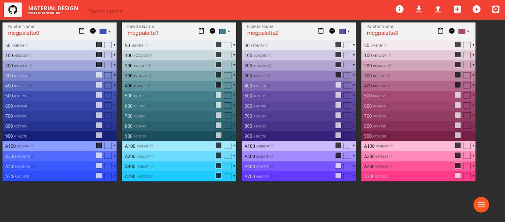
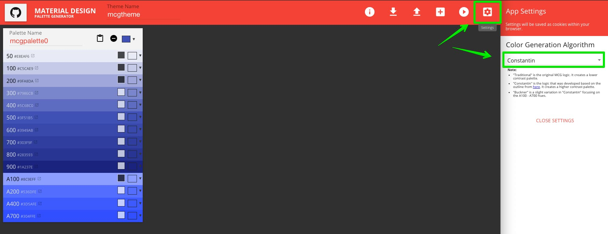

# Material Design Color Generator

[http://mcg.mbitson.com/](http://mcg.mbitson.com/)

A tool for generating a color palette for Material Design. Supports exporting to and importing from various Material Design frameworks and toolkits.

 - [Screenshot](#screenshot)
 - [Supported Frameworks & Tools](#supported-frameworks--tools)
 - [Color Generation](#color-generation)
 - [What's New?](#whats-new)
 - [Bugs & Questions](#bugs--questions)
 - [Planned Enhancements](#planned-enhancements)
 - [Contributions](#contributions)
 
 # Screenshot
 

# Supported Frameworks & Tools
This palette generation tool supports both **exporting** and **importing** palettes for the following frameworks and tools:
1) Android XML
2) AngularJS (Material)
3) AngularJS 2 (Material 2)
4) Ember Paper
5) Material Design Lite (SCSS)
6) Material UI (React)
7) Material UI Next (React)
8) Vue.js Material Design
9) Flutter
10) MCG Reimport (Proprietary)

When importing code, please ensure that it was code generated with this tool. In many cases, code generated outside of this tool should work as well, however this is unreliable.

# Color Generation
By default, we've chosen an Algorithm that seems to do a decent job at picking colors in most situations. However, if you find your palette doesn't look quite how you'd expect, you may change the algorithm that is used. Options are:
<ul>
    <li>"Traditional" is the original MCG logic. It is currently the default. It creates a lower contrast palette.</li>
    <li>"Constantin" is the logic that was developed based on the outline from <a href="http://stackoverflow.com/questions/28503998/how-to-create-custom-palette-with-custom-color-for-material-design-app/36229022#36229022">here</a>. It creates a higher contrast palette.</li>
    <li>"Buckner" is a slight variation in "Constantin" focusing on the A100 - A700 hues.</li>
</ul>

# What's New?
Please see the [CHANGELOG](https://github.com/mbitson/mcg/blob/master/README.md).

# Bugs & Questions
Should you encounter a bug/problem or have a question about the tool please report it using GitHub's "Issues" feature [here](https://github.com/mbitson/mcg/issues).

# Planned Enhancements
* (TOP) Determine which palette is primary, secondary, and so on. Drag and drop palettes.
* (MED) Remove individual color's hex details and create tooltip styled with all color details. (Hoverintent, populated only once it's opening, includes hex, rgb, cmyk, saturation, brightness. Possibly obtained using tinycolor)
* (MED) Improve performance by dynamically creating and destroying the color picker button and UI instead of loading a ton of Divs into the DOM for each color on the screen and hiding them.
* (LOW) Add reset buttons for each individual color in a palette (based on main palette color)
* (LOW) Create UI for more than 5 palettes (and/or alert user about dangers of using this many palettes)

# Contributions
* [fireflight1](https://github.com/fireflight1) - Initial concept, starting code base.
* [tkh44](https://github.com/tkh44) - Optimizations/fixes
* [simon04](https://github.com/simon04) - Contrast detection, bug fixes.
* [Constantin](https://stackoverflow.com/users/6115563/constantin) - Color algorithm logic per stack overflow answer [here](http://stackoverflow.com/a/36229022/3525315).
* [tabuckner](https://github.com/tabuckner) - Slight variation in 'Constantin' focusing on the A100 - A700 values.
* [vstollen](https://github.com/vstollen) - Added generators necessary to support Flutter 
* [berryp](https://github.com/berryp) - Bugfixes on Flutter support