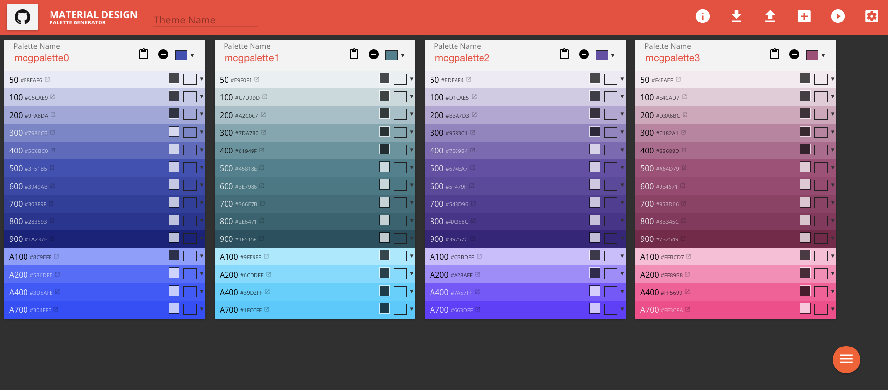

# Material Design Color Generator

A tool for generating a color palette for Material Design. [Click here](http://mcg.mbitson.com/)  to use the generator!

 - [Palette Export Options](#palette-export-options)
 - [Color Generation Options](#color-generation-options)
 - [What's New?](#whats-new)
 - [Planned Future Enhancements](#planned-future-enhancements)
 - [Bugs and Questions](#bugs-and-questions)
 - [Contributions](#contributions)
 - [Screenshot](#screenshot)

# Palette Export Options
Once you generate your palette(s), you may export the colors to the proper format for any of the following frameworks/toolkits:
1) Android XML
2) AngularJS (Material)
3) AngularJS 2 (Material 2)
4) Ember Paper
5) Material Design Lite (SCSS)
6) Material UI (React)
7) Material UI Next (React)
8) Vue.js Material Design
9) Flutter UI
10) MCG Reimport (Proprietary)

# Color Generation Options
By default, we've chosen an Algorithm that seems to do a decent job at picking colors in most situations. However, if you find your palette doesn't look quite how you'd expect, you may change the algorithm that is used. Options are:
<ul>
    <li>"Traditional" is the original MCG logic. It creates a lower contrast palette.</li>
    <li>"Constantin" is the logic that was developed based on the outline from <a href="http://stackoverflow.com/questions/28503998/how-to-create-custom-palette-with-custom-color-for-material-design-app/36229022#36229022">here</a>. It creates a higher contrast palette.</li>
    <li>"Buckner" is a slight variation in "Constantin" focusing on the A100 - A700 hues.</li>
</ul>

# What's New?
* 4/28/20 - [vstollen](https://github.com/vstollen) added in support for the Flutter UI Toolkit, with bugfixes from [berryp](https://github.com/berryp)
* 4/28/20 - [tabuckner](https://github.com/tabuckner) added slight variation on "Constantin" algorithm.
* 2/2/17 - Added support for Material UI's "Next" branch (React)
* 2/1/17 - Let the user select which color calculation algorithm they'd like to use. (constantin/traditional[mcg])
* 2/1/17 - Added the ability to link to a particular theme. URLs are now updated live as the theme is altered. Individual color alterations will not work with the URL method- use export/import.
* 2/1/17 - Added a "Demo" option that opens some basic AngularJS Material Design elements in the dynamic theme.
* 1/17/16 - Updated color calculation algorithms per the logic shared [here](http://stackoverflow.com/a/36229022/3525315). Thank you [Constantin](https://stackoverflow.com/users/6115563/constantin)!
* 1/10/16 - Added support for Material UI (React)
* 1/10/16 - Added support for Ember Paper SCSS.
* 1/10/16 - Added support for AngularJS2 Material 2 Framework.
* 1/10/16 - Added ability to export in a format recognized for reimport by MCG. (Enables sharing of palettes)
* 12/18/15 - [simon04](https://github.com/simon04) added support for automatic text-color contrast calculations. Thank you!
* 10/16/15 - Updated angular, it's dependencies, and other third party tools. Added SpeedDial from Material Design library.
* 10/9/15 - Import from AngularJS Material Design default palettes or from your own AngularJS Material Design Color Palette definition code!
* 10/9/15 - Added support for tinycolor.js instead of manual color manipulation.
* 7/22/15 - Improved Performance with more than 2 palettes.
* 7/14/15 - Support for <a href="http://www.COLOURlovers.com">COLOURlovers.com</a> palettes. You may now select a top palette and instantly have a material design theme!
* 4/16/15 - Modify any one palette color.
* 4/14/15 - Export your color choices to the AngularJS Material Design theme declaration code.

# Planned Future Enhancements
* (TOP) Determine which palette is primary, secondary, and so on. Drag and drop palettes.
* (MED) Remove individual color's hex details and create tooltip styled with all color details. (Hoverintent, populated only once it's opening, includes hex, rgb, cmyk, saturation, brightness. Possibly obtained using tinycolor)
* (MED) Improve performance by dynamically creating and destroying the color picker button and UI instead of loading a ton of Divs into the DOM for each color on the screen and hiding them.
* (LOW) Add reset buttons for each individual color in a palette (based on main palette color)
* (LOW) Create UI for more than 5 palettes (and/or alert user about dangers of using this many palettes)

# Bugs and Questions
* Should you encounter a bug/problem or have a question about the tool please report it using GitHub's "Issues" feature [here](https://github.com/mbitson/mcg/issues).

# Contributions
* [fireflight1](https://github.com/fireflight1) - Initial concept, starting code base.
* [tkh44](https://github.com/tkh44) - Optimizations/fixes
* [simon04](https://github.com/simon04) - Contrast detection, bug fixes.
* [Constantin](https://stackoverflow.com/users/6115563/constantin) - Color algorithm logic per stack overflow answer [here](http://stackoverflow.com/a/36229022/3525315).
* [tabuckner](https://github.com/tabuckner) - Slight variation in 'Constantin' focusing on the A100 - A700 values.
* [vstollen](https://github.com/vstollen) - Added generators necessary to support Flutter 
* [berryp](https://github.com/berryp) - Bugfixes on Flutter support

# Screenshot
